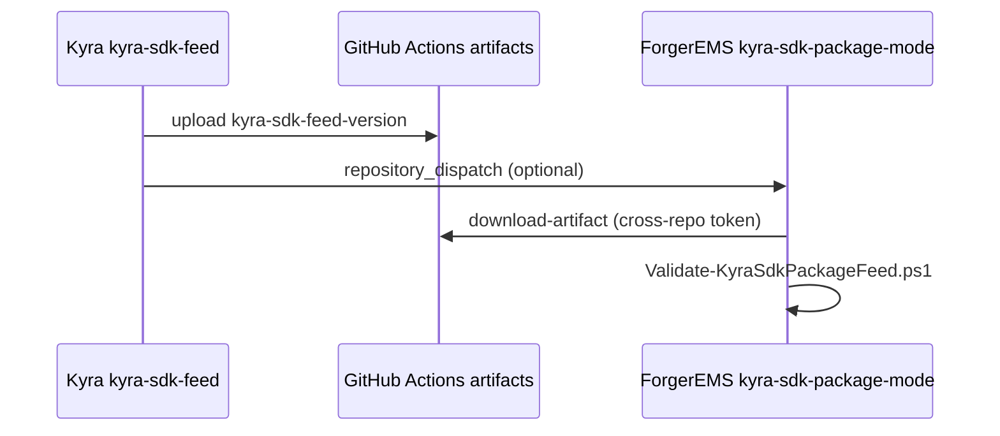

# Kyra SDK — ForgerEMS adapter plan (Phase 6b–6c)

> **Status (Phase 6d):** Hidden headless dogfood CLI wired. **`FORGEREMS_KYRA_SDK_ENABLED` defaults off.** Shipping Kyra tab (`Kyra.Core` / copilot path) is unchanged; no public UI toggle.

## Boundary

| ForgerEMS should reference | ForgerEMS must NOT reference |
|-----------------------------|------------------------------|
| **`Kyra.Sdk`** via `ForgerEMS.Kyra.HostAdapter` only | `Kyra.Core` for new SDK path (legacy tab keeps existing ref until cutover) |
| `ForgerEMS.Kyra.HostAdapter` (EMS-owned façade) | `Kyra.Local.Core`, `Kyra.Workers.Core`, `Kyra.Combined.Core` |
| | Proof apps: `Kyra.App.Wpf`, `Kyra.Local.App`, `Kyra.Workers.App.Wpf`, `Kyra.Combined.App.Wpf` |

Package source: `nuget.config` → `Kyra_Assistant/repo/release/sdk-current/feed/` (build with `tools/Kyra-Sdk-Release.ps1`; includes `Kyra.Contracts`, `Kyra.Local.Core`, `Kyra.Workers.Core`, `Kyra.Combined.Core`, `Kyra.Sdk`). Dev default: project reference when sibling tree exists (`/p:UseKyraSdkProjectReference=true`). CI: `/p:UseKyraSdkProjectReference=false`.

## Feature flag (default off)

| Item | Value |
|------|--------|
| Constant | `ForgerEmsKyraSdkFeatureFlags.DefaultEnabled` = **false** (documentation; not AND-ed with env) |
| Environment | `FORGEREMS_KYRA_SDK_ENABLED` — must parse as `true` (case-insensitive) |
| Factory | `KyraHostServiceFactory.Create()` → `KyraSdkHostService` when active, else `KyraHostServiceNotWired` |
| UI | Not wired to shipping Kyra tab / `MainViewModel` in 6c |
| Planned UI copy | Kyra SDK integration (planned — not enabled in this build) |

Malformed, missing, or non-`true` values → **NotWired** (no fake success).

## Pilot rollout

1. **Phase 6c (done):** `KyraSdkHostService` delegates to `KyraSdkClient`; maps host DTOs ↔ SDK types.
2. **First mode:** `KyraHostMode.LocalOnly` when flag is `true`.
3. **Worker / Combined:** require gateway + operator opt-in; adapter returns honest `NotConfigured` for Worker-only without gateway.
4. **Cloud context sharing:** off unless `KyraHostPrivacyOptions.AllowCloudContextSharing`; redacted summary only via `KyraHostContextMapper`.
5. **Tokens:** `[JsonIgnore]` on `KyraHostRequest.BearerToken`; per-request memory-only; never persisted.

## EMS context mapping

`KyraHostContextMapper` maps:

- `HostApplicationId` / `HostSessionId` (trimmed, length-capped)
- `RedactedDeviceReportSummary` → `emsRedactedReportSummary` only when cloud sharing is enabled
- Path-like or forbidden-key content → `[REDACTED_EMS_CONTEXT]`

Forbidden: raw logs, file paths, usernames, serials, secrets, support bundles, memory bodies, tokens.

## Types (Phase 6c)

| Type | Role |
|------|------|
| `IKyraHostService` | EMS-facing async API |
| `KyraSdkHostService` | SDK-backed implementation |
| `KyraHostServiceFactory` | Env-gated factory |
| `KyraHostRequestMapper` | Host ↔ SDK DTO mapping |
| `KyraHostServiceNotWired` | Returns `NotWired` when flag off |
| `KyraHostContextMapper` | Redacted EMS metadata |
| `KyraSdkDogfoodInvoker` | Hidden dogfood entry (HostAdapter) |
| `ForgerEMS.Kyra.SdkDogfood` | Isolated console tool (no WPF type conflicts) |
| `KyraSdkDogfoodProcessLauncher` | WPF startup spawns tool; no UI |

`ForgerEMS.Wpf` does **not** reference `Kyra.Sdk` or `ForgerEMS.Kyra.HostAdapter` directly (avoids `Kyra.Core` vs `Kyra.Local.Core` conflicts). Dogfood runs via isolated tool **`ForgerEMS.Kyra.SdkDogfood`** copied to `tools/kyra-sdk-dogfood/` beside the app.

## Hidden dogfood path (Phase 6d)

Headless CLI (no visible UI, no `MainWindow`). `ForgerEMS.exe` spawns `tools/kyra-sdk-dogfood/ForgerEMS.Kyra.SdkDogfood.exe`:

```text
ForgerEMS.exe --kyra-sdk-dogfood [--kyra-sdk-prompt "optional prompt"]
```

The tool can also be run directly for dev:

```text
tools\kyra-sdk-dogfood\ForgerEMS.Kyra.SdkDogfood.exe --kyra-sdk-version 1.2.1-preview.1
```

Requires **`FORGEREMS_KYRA_SDK_ENABLED=true`**. Otherwise returns **`NotWired`** and exit code `1`.

| Env | Role |
|-----|------|
| `FORGEREMS_KYRA_SDK_ENABLED` | Must be `true` to use SDK |
| `FORGEREMS_KYRA_GATEWAY_URL` | Optional per-run gateway (not stored) |
| `FORGEREMS_KYRA_GATEWAY_BETA_TOKEN` | Optional per-run token (memory/env only; redacted in report) |

Defaults: **LocalOnly**, cloud sharing **off**, enrichment **off**. Writes `kyra-sdk-dogfood.txt` under the EMS runtime diagnostics folder.

Safe host metadata only: `ForgerEMS`, `appVersion`, `feature=hidden-sdk-dogfood`. No scans, bundles, logs, paths, serials, or usernames.

## Example call (dev / dogfood only)

```csharp
// Requires FORGEREMS_KYRA_SDK_ENABLED=true in the process environment.
using var host = (KyraSdkHostService)KyraHostServiceFactory.Create();
var response = await host.ProcessAsync(new KyraHostRequest
{
    Mode = KyraHostMode.LocalOnly,
    UserPrompt = "Summarize USB toolkit status for the operator.",
    HostApplicationId = "ForgerEMS",
    HostSessionId = sessionId,
}, cancellationToken);
```

## Phase 6e (done)

- Kyra `release/sdk-current/feed/` packs all SDK dependencies for package-mode restore.
- ForgerEMS CI: `dotnet restore/build -p:UseKyraSdkProjectReference=false` (see `nuget.config` → `feed/`).

## Phase 6f (done) — CI artifact feed

| Item | Value |
|------|--------|
| Kyra workflow | `.github/workflows/kyra-sdk-feed.yml` |
| Artifact | `kyra-sdk-feed-<version>` (entire `release/sdk-current/`) |
| Kyra docs | `Kyra_Assistant/docs/KYRA_SDK_CI_ARTIFACTS.md` |
| EMS validate | `tools/Validate-KyraSdkPackageFeed.ps1` |
| EMS workflow | `.github/workflows/kyra-sdk-package-mode.yml` |
| Feed override | `-KyraSdkFeedPath` or `KYRA_SDK_FEED_PATH` → writes `nuget.config.ci` |

### CI consumption (ForgerEMS, no Kyra source tree)

1. Download artifact `kyra-sdk-feed-1.1.4` from Kyra `kyra-sdk-feed` workflow.
2. Extract; set feed path to `.../feed` (or `release/sdk-current` root).

```powershell
$env:KYRA_SDK_FEED_PATH = 'D:\artifacts\kyra-sdk-feed-1.1.4\feed'
cd ForgerEMS_App\repo
.\tools\Validate-KyraSdkPackageFeed.ps1 -Configuration Release
```

Or pass `-KyraSdkFeedPath` explicitly. Script runs restore/build/tests with `/p:UseKyraSdkProjectReference=false`.

## Phase 6g (done) — cross-repo CI handoff

| Item | Value |
|------|--------|
| Kyra workflow | `.github/workflows/kyra-sdk-feed.yml` — upload `kyra-sdk-feed-<version>`, optional `repository_dispatch` |
| EMS workflow | `.github/workflows/kyra-sdk-package-mode.yml` — download cross-repo artifact, validate |
| Kyra docs | `Kyra_Assistant/docs/KYRA_SDK_CI_ARTIFACTS.md` |
| Secrets (Kyra) | `FORGEREMS_DISPATCH_TOKEN`; variable `FORGEREMS_REPO` |
| Secrets (EMS) | `KYRA_SDK_ARTIFACT_TOKEN` (`actions:read` on Kyra repo) |

### Handoff flow



### EMS workflow triggers

| Trigger | Use |
|---------|-----|
| `repository_dispatch` `kyra-sdk-feed-published` | Auto after Kyra main success (when Kyra dispatch configured) |
| `workflow_dispatch` | Manual: `kyra_run_id` + `kyra_repository`, or `kyra_sdk_feed_path` |
| `workflow_call` | Reusable from other EMS workflows |

### Exact CI command (EMS job)

```powershell
.\tools\Validate-KyraSdkPackageFeed.ps1 -Configuration Release -KyraSdkFeedPath '<feed-or-sdk-current>'
```

Underlying restore/build use `-p:UseKyraSdkProjectReference=false` and `nuget.config.ci`.

### Limitations

- Artifacts are not visible across repos without PAT + `repository`/`run-id`.
- `workflow_run` does not span Kyra → ForgerEMS; use dispatch or manual dispatch.
- No sibling Kyra source tree required in EMS CI.

### Next (post-6g)

- Optional in-app dev hook (still behind `FORGEREMS_KYRA_SDK_ENABLED`; no public toggle).
- Private NuGet feed to replace artifact download for agents.
- Operator-visible pilot toggle only after dogfood sign-off.

## Related Kyra documentation

- Kyra repo: `docs/KYRA_SDK_FOR_EMS_INTEGRATION.md`
- Kyra repo: `docs/KYRA_SPLIT_ARCHITECTURE.md` (Phase 6a SDK lane)
- HostAdapter: `src/ForgerEMS.Kyra.HostAdapter/Kyra.Sdk.Reference.md`

## Explicit non-goals (6c)

- Replacing copilot / `MainViewModel` Kyra path
- Bundling `KyraCombinedApp.exe` or proof desktops
- Default Worker or Combined orchestration
- Token persistence or cloud sharing on by default
- Rebuilding `release/current` in either repo
